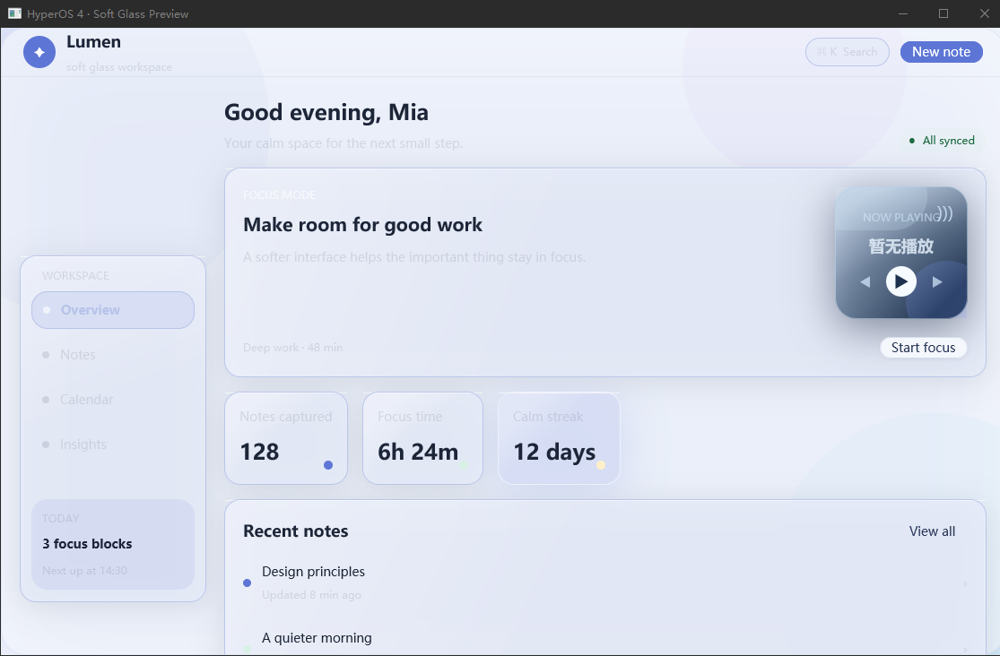
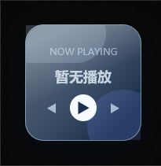

# HyperOS 4 Soft Glass for GPUI

一个面向 GPUI Component 的 HyperOS 4 柔光玻璃主题。它把柔和的冷色调、半透明表面、顶部高光和环境阴影封装成语义 token，并提供可选的短时缓动动画。



播放器卡片与工作区处于同一个 GPUI 场景，透明度和反射层会直接透出其下方的光晕：



## 特性

- 浅色和深色 `ThemeConfig`，可直接用于 `Theme::apply_config`
- `GlassTokens::from_theme`：从当前语义主题派生玻璃表面颜色，避免在组件里散落色值
- `glass_surface` / `glass_interactive`：半透明填充、hairline 边框、顶部 specular 高光和双层阴影
- `soft_glass_window_background()`：为需要整窗系统 backdrop blur 的应用启用原生合成器支持
- `glass_entrance`：360ms ease-out 入场动画，只在动画期间请求帧
- `ease_in_out_cubic`、`ease_out_back`、`ease_out_quint` 和 `interpolate_hsla` 可用于应用层状态动画
- `examples/preview.rs` 提供可运行的主题预览

GPUI 0.2.2 提供了 `WindowBackgroundAppearance::Blurred`，`soft_glass_window_background()` 已将它封装到主题 API 中：Windows 使用 Acrylic，macOS 使用 Visual Effect，支持的 Wayland 合成器使用原生 blur。注意它作用于整个原生窗口；GPUI 暂时没有逐组件的 backdrop blur 或场景纹理采样 API，因此同窗口组件使用半透明 tint、方向性反射和边缘高光作为可移植 fallback。要实现真正的逐像素折射，需要在 GPUI renderer 中增加 offscreen scene texture、blur pass、UV displacement 和 Fresnel shader。

## 使用

```toml
hyperos4-gpui-theme = { git = "https://github.com/YMRwithNoworry/hyperos4-gpui-theme" }
```

```rust
use gpui::{div, App, Window, WindowOptions};
use gpui_component::theme::ThemeMode;
use hyperos4_gpui_theme::{
    glass_interactive, soft_glass_window_background, GlassTokens, HyperOs4Theme,
};

fn setup(cx: &mut App) {
    gpui_component::init(cx);
    HyperOs4Theme::install(cx, ThemeMode::Light);
}

fn panel(window: &Window, cx: &App) -> impl gpui::IntoElement {
    let glass = GlassTokens::from_theme(cx.theme());
    glass_interactive(div().child("柔光玻璃"), glass)
}

fn window_options() -> WindowOptions {
    WindowOptions {
        window_background: soft_glass_window_background(),
        ..Default::default()
    }
}
```

运行预览：

```text
cargo run --example preview
```

## 设计说明

玻璃效果是组件级 opt-in，不会给所有控件默认添加动效。入场动画使用 ease-out quint，hover 仅改变表面 tint 和边缘，不依赖 hover 才能发现内容；这与 GPUI Component 的桌面交互和 reduced-motion 友好原则一致。
